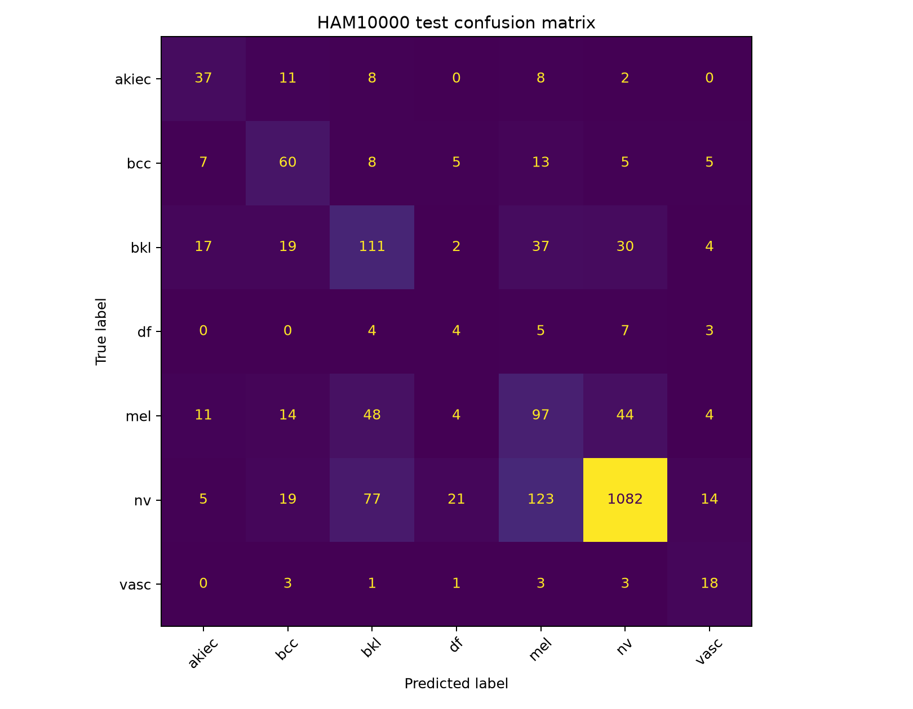
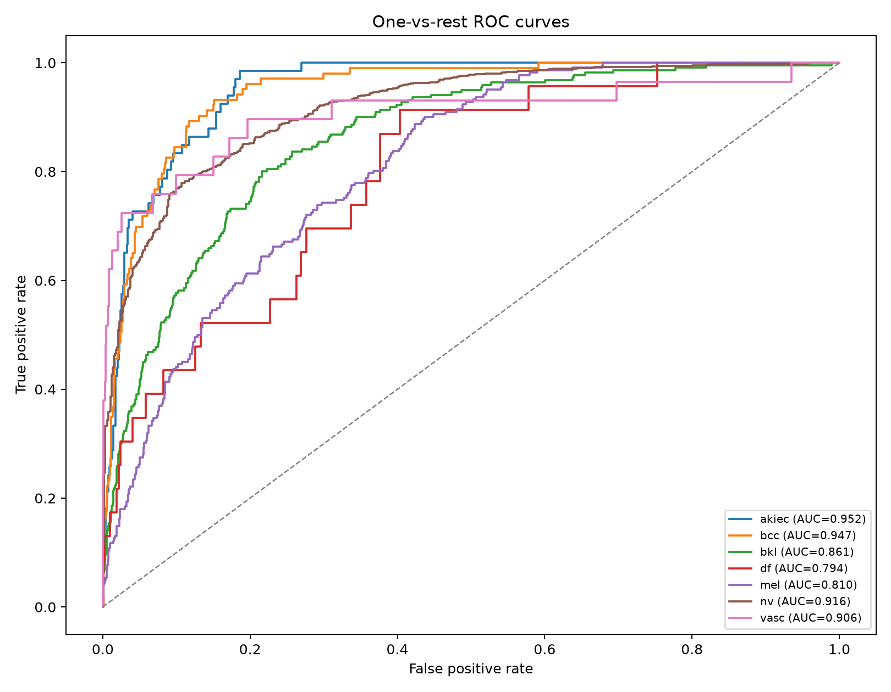
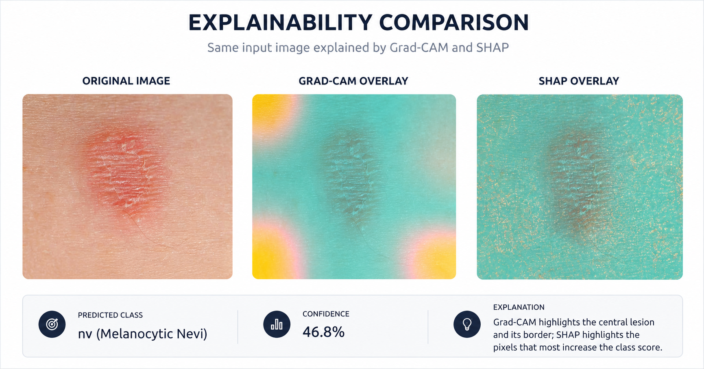
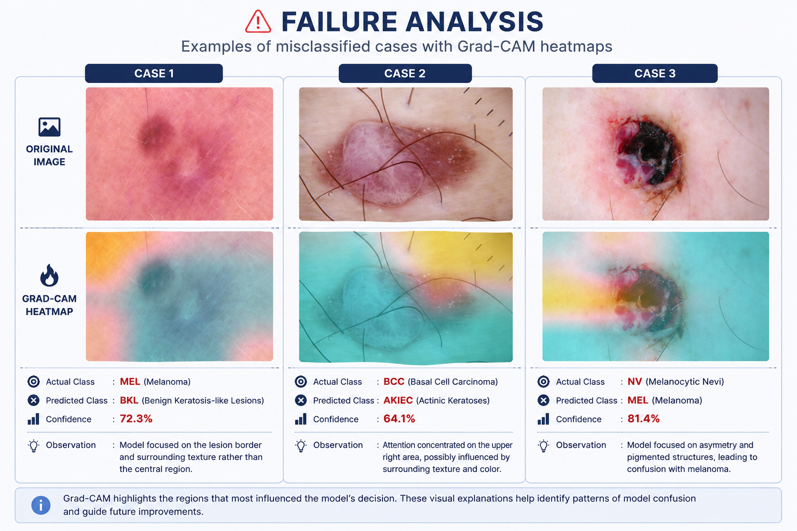

# Explainable Skin Lesion Classification

**Author: Ahan Roy**

A compact deep learning project for **7-class dermoscopic skin-lesion classification** using the **HAM10000** dataset. The model uses **DenseNet121 transfer learning**, class-weighted training, and two complementary explainability methods: **Grad-CAM** and **SHAP**, with a simple user-interface.

> **Scope:** This is an research portfolio project. It is not a medical device or a diagnostic tool.

---

## Why this project?

A classifier can give a good score and still be difficult to inspect. I wanted the project to cover the full workflow:

**data preparation → imbalance handling → training → evaluation → explanation → failure analysis → deployment**

The goal is not to compare many models, but to build one complete and explainable pipeline.

---

## Pipeline

```text
HAM10000
   │
   ▼
Lesion-aware train / validation / test split
   │
   ▼
Resize + normalization + augmentation
   │
   ▼
DenseNet121 (ImageNet transfer learning)
   │
   ├── Weighted Cross-Entropy
   ├── Macro-F1 checkpoint selection
   └── Early stopping
   │
   ▼
Evaluation
   │
   ├── Accuracy / Precision / Recall / F1
   ├── ROC-AUC
   ├── Confusion Matrix
   └── Failure Analysis
   │
   ▼
Explainability
   ├── Grad-CAM
   └── SHAP
   │
   ▼
Streamlit App
```

---

## Dataset

The project uses **HAM10000 (Human Against Machine with 10,000 training images)** with seven diagnostic classes:

| Code | Class |
|---|---|
| `akiec` | Actinic keratoses / Bowen's disease |
| `bcc` | Basal cell carcinoma |
| `bkl` | Benign keratosis-like lesions |
| `df` | Dermatofibroma |
| `mel` | Melanoma |
| `nv` | Melanocytic nevi |
| `vasc` | Vascular lesions |

The dataset contains **10,015 dermoscopic images**. The images themselves are not included in this repository.

---

## Model

**DenseNet121** is used with ImageNet pretrained weights. For CPU-friendly development, the DenseNet feature extractor is kept frozen and the final 7-class classification head is trained.

The training loss uses **class weights** because the HAM10000 classes are highly imbalanced.

---

## Results

The supplied test confusion matrix contains **2,004 test images**, with **1,409 correct predictions**.

| Metric | Test Result |
|---|---:|
| Accuracy | **70.31%** |
| Macro Precision | **44.76%** |
| Macro Recall | **52.66%** |
| Macro F1 | **47.86%** |
| Macro ROC-AUC (OvR) | **88.37%** |

### Confusion Matrix

<div align="center">
  
</div>

### ROC-AUC

The one-vs-rest AUC values from the supplied evaluation output are:

| Class | AUC |
|---|---:|
| `akiec` | 0.952 |
| `bcc` | 0.947 |
| `bkl` | 0.861 |
| `df` | 0.794 |
| `mel` | 0.810 |
| `nv` | 0.916 |
| `vasc` | 0.906 |

<div align="center">
  
</div>

The gap between accuracy and macro-F1 is a useful reminder that overall accuracy alone does not describe performance well on this imbalanced dataset.

---

## Explainability

Every prediction can be inspected using two complementary views.

**Grad-CAM** highlights spatial regions in the DenseNet feature maps associated with the predicted class.

**SHAP** uses `GradientExplainer` to attribute the predicted class score back toward the input image.

<div align="center">
  
</div>

The two explanations are not expected to match exactly. Grad-CAM is **feature-map based**, while SHAP is **input-attribution based**.

---

## Failure Analysis

The evaluation pipeline automatically reviews **2–3 high-confidence misclassified samples** using Grad-CAM.

I use these cases to check:

- whether the model focused on the lesion or an image artifact
- whether visually similar classes are being confused
- whether the model is overconfident when it is wrong

<div align="center">
  
</div>

This is one of the main parts of the project: the aim is not only to report where the model succeeds, but also to inspect where it fails.

---

## Streamlit App

The app combines prediction and explainability in one interface.

It shows:

- predicted class
- confidence score
- class probabilities
- original image
- Grad-CAM overlay
- SHAP overlay
- short natural-language explanation

Run locally with:

```bash
streamlit run app.py
```

---

## Project Structure

```text
interpretable-dermoscopic-image-classifier-xai/
│
├── app.py
├── README.md
├── requirements.txt
├── pyproject.toml
├── LICENSE
├── .gitignore
│
├── assets/
│   ├── app_demo.png
│   ├── confusion_matrix.png
│   ├── explainability_comparison.png
│   ├── failure_analysis.png
│   └── roc_curves.png
│
├── data/
│   └── README.md
│
├── models/
│   └── README.md
│
├── scripts/
│   ├── preprocess.py
│   ├── train.py
│   └── evaluate.py
│
└── src/
    ├── config.py
    ├── data.py
    ├── explainability.py
    ├── metrics.py
    ├── model.py
    └── utils.py
```

---

## Key Design Choices

**Weighted loss** — gives more importance to under-represented classes.

**Macro-F1** — used for checkpoint selection so the dominant `nv` class does not decide the model quality by itself.

**Lesion-aware splitting** — keeps related lesion images together and reduces the risk of leakage between train and evaluation data.

**Grad-CAM + SHAP** — gives two different views of what the model used for its prediction.

**Single model** — DenseNet121 is intentionally the only CNN in the project; this is an explainability-focused pipeline, not a benchmarking study.

---

## Tech Stack

`Python` · `PyTorch` · `Torchvision` · `DenseNet121` · `Grad-CAM` · `SHAP` · `Scikit-learn` · `Streamlit`

---

## License and dataset note

The source code is released under the **MIT License**.

Before publishing a trained checkpoint or screenshots containing dataset examples, verify that your use of the HAM10000 dataset follows its stated terms and the terms of the source from which you obtained it.

The source code in this repository can be licensed separately from the dataset and from any trained weights you choose to publish.
